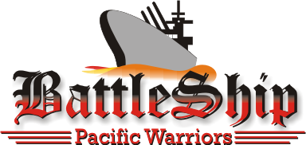
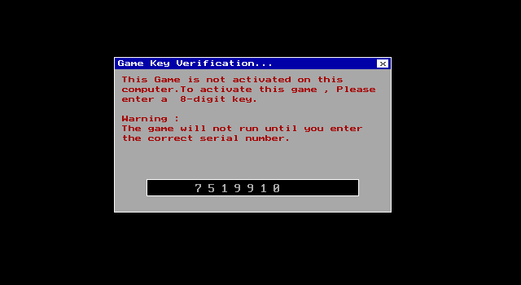
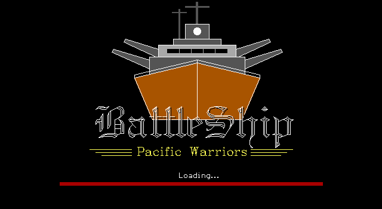
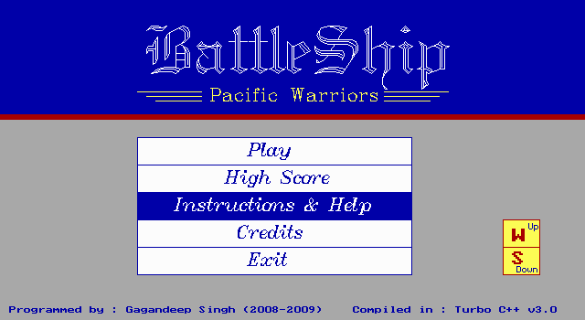
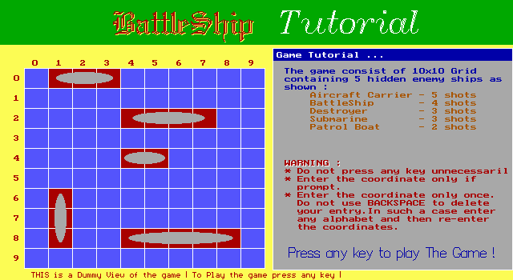
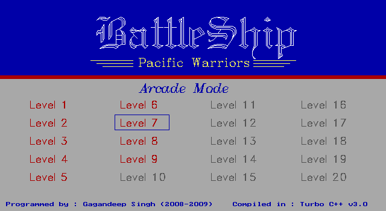
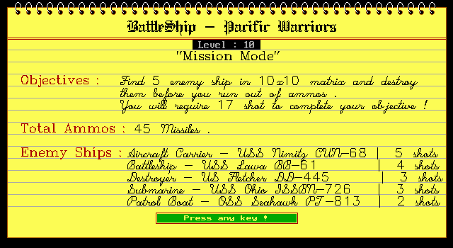
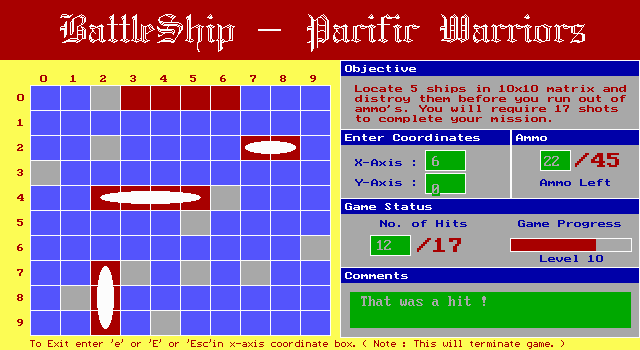
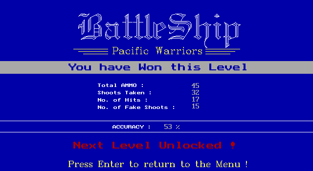

**(2008-09 High school project)**

# BattleShip - Pacific Warriors (2008-09)

‘BattleShip - Pacific Warriors ’ is a single player board game consisting of 10x10 grid containing 5 hidden enemy Ship.  Player’s  objective is to locate these ship and destroy them in specified number of missiles. You will require  17 shots to complete your game.

The Game includes three game mode - Mission , Arcade , Training with 20 Level each. The number of missiles decreases with every level you unlock and the game becomes difficult.

#### Programming Language:

The source code has been programmed and Compiled in **C++** using Turbo C++ version 3.0.

## Preamble

The project titled ‘BattleShip - Pacific Warriors’ has been programmed as per the requirement of CBSE for the subject Computer Science (083) for AISSCE -2008-09. 

The Project aims at developing an event game in C++ using concepts of graphics, sounds, structure, classes, datafile handling as described in Class XI and XII text book. 

## Thesis
Click [here](_Publish/Thesis_BattleShip_2009.pdf) to download thesis for the project.

## Screenshots

|    |   |
|---|---|
|    |   |
|   |   |
|   |   |
|   |   |

## How to run

- Download and extract [Disk_BattleShip.zip](_Publish/Disk_BattleShip.zip) from [_Publish/](_Publish) directory.
- Run 'BLT_Autorun.exe' and select 'Install' option. (Select 'User Guide' to view system requirements and instructions)
- After the installation is completed open the destination folder and run ‘BTLSHIP.exe’.
- Use Activation key: 7519910
